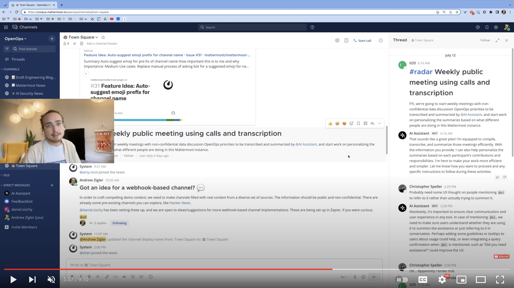

# Install

For step-by-step installation instructions, please refer to the [README](../README.md#install) or review the content below. For additional configuration help, please refer to the [`mattermost-plugin-ai` repository](https://github.com/mattermost/mattermost-plugin-ai).

## Videos

- ["OpenOps is Available! Start Experimenting with Open Source AI"](https://www.youtube.com/watch?v=20KSKBzZmik) 

## Articles

- ["Start using GPT-4 and local models with the open source OpenOps framework"](https://mattermost.com/blog/open-source-ai-framework)

## Gitpod

1. Click the badge above and start your Gitpod workspace
2. You will see VSCode interface and the workspace will configure itself automatically. Wait for the services to start and for your `root` login for Mattermost to be generated in the terminal
3. Run `./configure_openai.sh sk-<your openai key>` to add your API credentials *or* use the Mattermost system console to configure the plugin
4. Access Mattermost and log in with the credentials supplied in the terminal.
